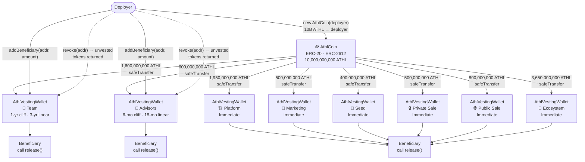
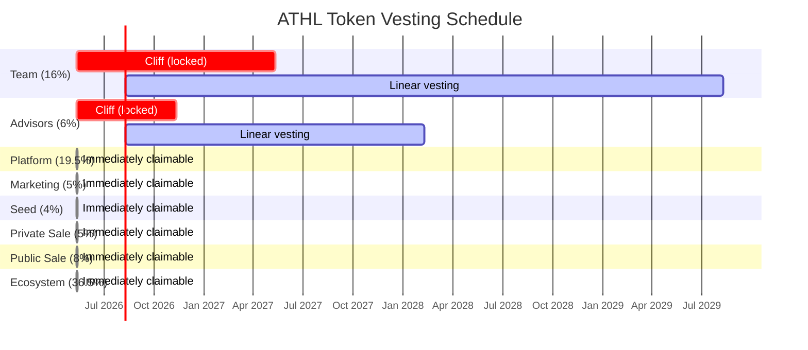

# 🪙 AthlCoin (ATHL)

AthlCoin is the primary ERC-20 token for the Athlete ecosystem. It is implemented using OpenZeppelin contracts on top of a [Scaffold-ETH 2](https://scaffoldeth.io) (Foundry) monorepo.

⚙️ Built using NextJS, RainbowKit, Foundry, Wagmi, Viem, and TypeScript.

## Token properties

| Property | Value |
|---|---|
| Name | AthlCoin |
| Symbol | ATHL |
| Total supply | 10,000,000,000 ATHL (fixed — no minting or burning) |
| Decimals | 18 |
| Standard | ERC-20 + ERC-2612 (gasless permit) |

## Token distribution

| Recipient | Amount | % | Vesting schedule |
|---|---|---|---|
| Ecosystem | 3,650,000,000 ATHL | 36.5% | Immediate (no cliff or linear lock) |
| Platform | 1,950,000,000 ATHL | 19.5% | Immediate (no cliff or linear lock) |
| Team | 1,600,000,000 ATHL | 16% | 1-year cliff, then linear over 3 years |
| Public Sale | 800,000,000 ATHL | 8% | Immediate (no cliff or linear lock) |
| Advisors | 600,000,000 ATHL | 6% | 6-month cliff, then linear over 18 months |
| Marketing | 500,000,000 ATHL | 5% | Immediate (no cliff or linear lock) |
| Private Sale | 500,000,000 ATHL | 5% | Immediate (no cliff or linear lock) |
| Seed | 400,000,000 ATHL | 4% | Immediate (no cliff or linear lock) |

Vesting is managed by `AthlVestingWallet` — a custom multi-beneficiary, revocable vesting contract. One pool contract is deployed per allocation group. The revoker (deployer, or a treasury multisig in production) can:

- Register multiple beneficiaries with individual allocations via `addBeneficiary(address, uint256)`
- Revoke a beneficiary's unvested tokens back to the revoker via `revoke(address)`

Beneficiaries claim their vested tokens independently by calling `release()` on their group's wallet.

## Deployment flow



## Vesting schedule



## Key files

| File | Purpose |
|---|---|
| `packages/foundry/contracts/AthlCoin.sol` | ERC-20 token — fixed 10B supply with ERC-2612 permit |
| `packages/foundry/contracts/AthlVestingWallet.sol` | Multi-beneficiary, revocable vesting contract |
| `packages/foundry/script/DeployAthlCoin.s.sol` | Deploys token + all eight vesting wallets |
| `packages/foundry/test/AthleteCoin.t.sol` | Token tests |
| `packages/foundry/test/AthlVestingWallet.t.sol` | Vesting contract tests |
| `audits/Security-Audit-2026-02-24.md` | Security audit (February 2026) |

## Deploy

```bash
yarn deploy                                    # deploy all contracts
yarn deploy --file DeployAthlCoin.s.sol        # deploy AthlCoin + vesting wallets only
```

> **Before deploying to a live network**, call `addBeneficiary(address, amount)` on each vesting wallet for every beneficiary. Allocations must sum to the group's pool amount. Update the `revoker` address to a treasury multisig in `DeployAthlCoin.s.sol`.

## Requirements

Before you begin, you need to install the following tools:

- [Node (>= v20.18.3)](https://nodejs.org/en/download/)
- Yarn ([v1](https://classic.yarnpkg.com/en/docs/install/) or [v2+](https://yarnpkg.com/getting-started/install))
- [Git](https://git-scm.com/downloads)

## Quickstart

1. Install dependencies:

```bash
cd athl-coin
yarn install
```

2. Run a local network in the first terminal:

```bash
yarn chain
```

3. On a second terminal, deploy the contracts:

```bash
yarn deploy
```

4. On a third terminal, start the NextJS app:

```bash
yarn start
```

Visit the app on: `http://localhost:3000`. You can interact with your smart contracts using the `Debug Contracts` page. App config lives in `packages/nextjs/scaffold.config.ts`.

**Note:** Vesting wallet addresses in the frontend are derived from the current local Anvil deployment. After running `yarn deploy` on a fresh chain, update any hardcoded addresses to match the new broadcast addresses.

## Testing

```bash
yarn foundry:test                                              # run all tests
forge test --match-path test/AthlVestingWallet.t.sol -v       # vesting tests only
forge test --match-path test/AthleteCoin.t.sol -v             # token tests only
forge test -vvv                                                # show traces on failure
```

## Security

A security audit was performed in February 2026. See [`audits/Security-Audit-2026-02-24.md`](audits/Security-Audit-2026-02-24.md) for findings and remediation status.